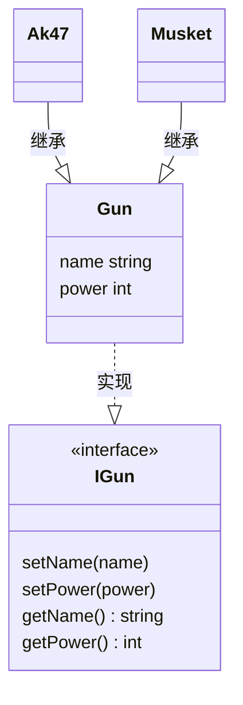
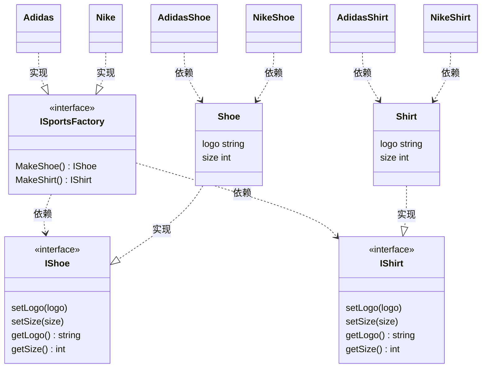
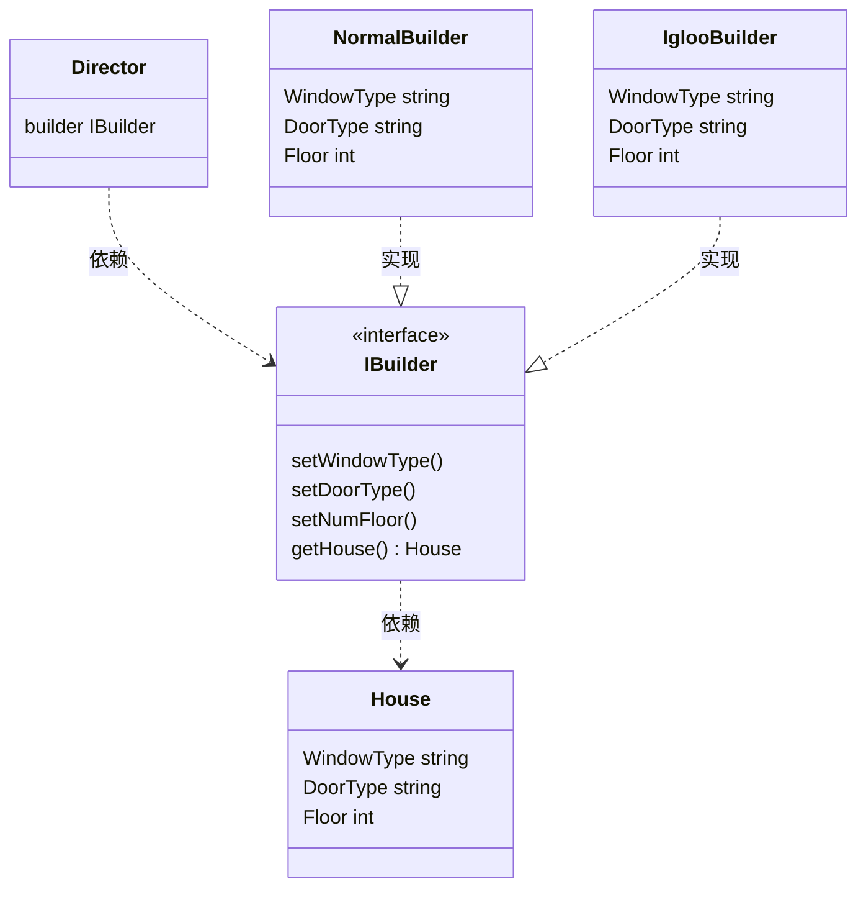
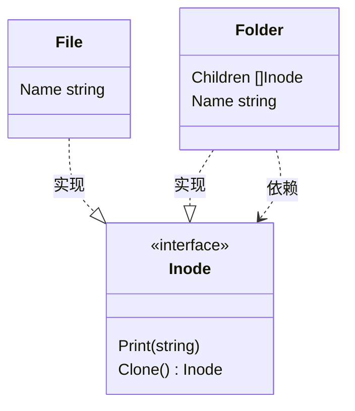

# 设计模式Go语言版本

> 代码来自https://refactoringguru.cn/design-patterns

[TOC]

## 创建型模式

### 工厂模式

```mermaid
classDiagram
class IGun
<<interface>> IGun
IGun: setName(name)
IGun: setPower(power)
IGun: getName() string
IGun: getPower() int

class Gun
Gun: name string
Gun: power int

class Ak47
class Musket

Gun ..|> IGun: 实现
Ak47 --|> Gun: 继承
Musket --|> Gun: 继承
```

### 抽象工厂模式

```mermaid
classDiagram
class ISportsFactory
<<interface>> ISportsFactory
ISportsFactory: MakeShoe() IShoe
ISportsFactory: MakeShirt() IShirt

class IShoe
<<interface>> IShoe
IShoe: setLogo(logo)
IShoe: setSize(size)
IShoe: getLogo() string
IShoe: getSize() int

class IShirt
<<interface>> IShirt
IShirt: setLogo(logo)
IShirt: setSize(size)
IShirt: getLogo() string
IShirt: getSize() int

class Shoe
Shoe: logo string
Shoe: size int

class Shirt
Shirt: logo string
Shirt: size int

class Adidas
class Nike

class AdidasShirt
class AdidasShoe
class NikeShirt
class NikeShoe

ISportsFactory ..> IShoe: 依赖
ISportsFactory ..> IShirt: 依赖
Shoe ..|> IShoe: 实现
Shirt ..|> IShirt: 实现
Adidas ..|> ISportsFactory: 实现
Nike ..|> ISportsFactory: 实现
AdidasShirt ..> Shirt: 依赖
AdidasShoe ..> Shoe: 依赖
NikeShirt ..> Shirt: 依赖
NikeShoe ..> Shoe: 依赖
```

### 生成器模式

```mermaid
classDiagram
class IBuilder
<<interface>> IBuilder
IBuilder: setWindowType()
IBuilder: setDoorType()
IBuilder: setNumFloor()
IBuilder: getHouse() House

class House
House: WindowType string
House: DoorType string
House: Floor int

class Director
Director: builder IBuilder

class NormalBuilder
NormalBuilder: WindowType string
NormalBuilder: DoorType string
NormalBuilder: Floor int

class IglooBuilder
IglooBuilder: WindowType string
IglooBuilder: DoorType string
IglooBuilder: Floor int

IBuilder ..> House: 依赖
Director ..> IBuilder: 依赖
NormalBuilder ..|> IBuilder: 实现
IglooBuilder ..|> IBuilder: 实现
```

### 原型模式

```mermaid
classDiagram
class Inode
<<interface>> Inode
Inode: Print(string)
Inode: Clone() Inode

class File
File: Name string

class Folder
Folder: Children []Inode
Folder: Name string

File ..|> Inode: 实现
Folder ..|> Inode: 实现
Folder ..> Inode: 依赖
```