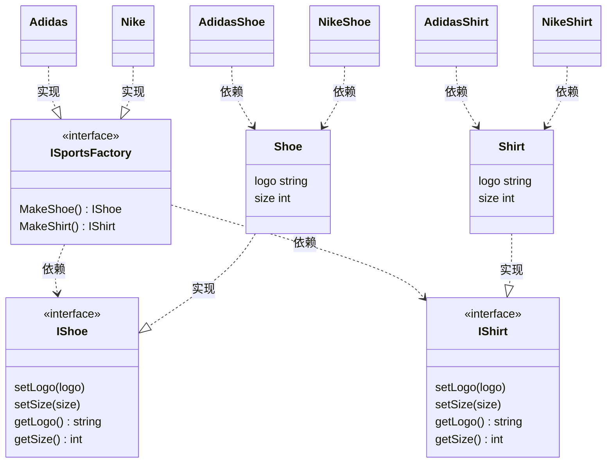

# 设计模式Go语言版本

[TOC]

## 创建型模式

### 抽象工厂模式

```mermaid
classDiagram
class ISportsFactory
<<interface>> ISportsFactory
ISportsFactory: MakeShoe() IShoe
ISportsFactory: MakeShirt() IShirt

class IShoe
<<interface>> IShoe
IShoe: setLogo(logo)
IShoe: setSize(size)
IShoe: getLogo() string
IShoe: getSize() int

class IShirt
<<interface>> IShirt
IShirt: setLogo(logo)
IShirt: setSize(size)
IShirt: getLogo() string
IShirt: getSize() int

class Shoe
Shoe: logo string
Shoe: size int

class Shirt
Shirt: logo string
Shirt: size int

class Adidas
class Nike

class AdidasShirt
class AdidasShoe
class NikeShirt
class NikeShoe

ISportsFactory ..> IShoe: 依赖
ISportsFactory ..> IShirt: 依赖
Shoe ..|> IShoe: 实现
Shirt ..|> IShirt: 实现
Adidas ..|> ISportsFactory: 实现
Nike ..|> ISportsFactory: 实现
AdidasShirt ..> Shirt: 依赖
AdidasShoe ..> Shoe: 依赖
NikeShirt ..> Shirt: 依赖
NikeShoe ..> Shoe: 依赖
```